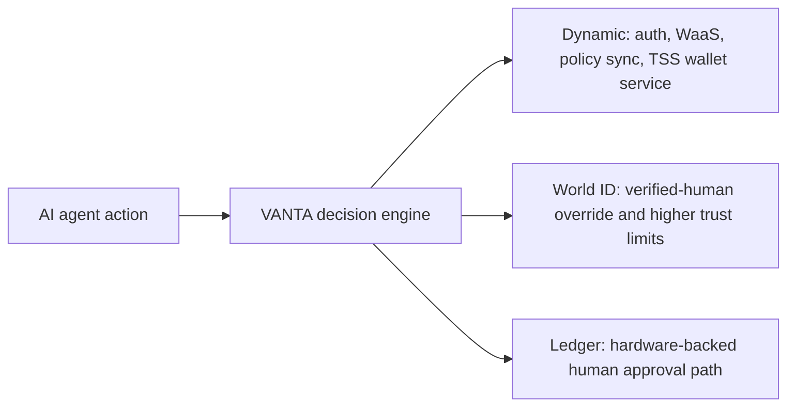

# VANTA Partner Integration Docs

This folder isolates the sponsor-facing integrations in VANTA so judges can verify them quickly without digging through unrelated app code.

## ETHGlobal Cannes 2026 Snapshot

Prize snapshot sourced from the ETHGlobal Cannes 2026 prizes page on April 5, 2026:

| Partner | Total prize pool | Relevant VANTA fit |
| --- | ---: | --- |
| Dynamic | $5,000 | Javascript SDK, Policy API, and Node SDK wallet service |
| World | $20,000 | World ID 4.0 proof of humanity as a real transaction constraint |
| Ledger | $10,000 | Hardware-backed trust layer for agent approvals and wallet-provider integration |

## Integration Map

## Read In This Order

1. [Dynamic Integration](./dynamic-integration.md)
2. [World ID Integration](./world-id-integration.md)
3. [Ledger Integration](./ledger-integration.md)

## What Each Doc Proves

| Doc | Focus |
| --- | --- |
| `dynamic-integration.md` | VANTA uses Dynamic's Javascript SDK directly, syncs rules into Dynamic's Policy API, and includes a Node SDK service for TSS wallets. |
| `world-id-integration.md` | World ID changes actual transaction behavior through backend proof verification, nullifier uniqueness checks, and higher-trust policy logic. |
| `ledger-integration.md` | Ledger is integrated as the human trust layer for agent approvals through Ledger Wallet Provider and dedicated hardware-wallet UX. |

## External References

- ETHGlobal prize page: <https://ethglobal.com/events/cannes2026/prizes>
- Dynamic docs: <https://www.dynamic.xyz/docs/javascript/introduction/welcome>
- World docs: <https://docs.world.org/world-id/overview>
- Ledger docs: <https://developers.ledger.com/docs/ledger-wallet-provider/overview>
