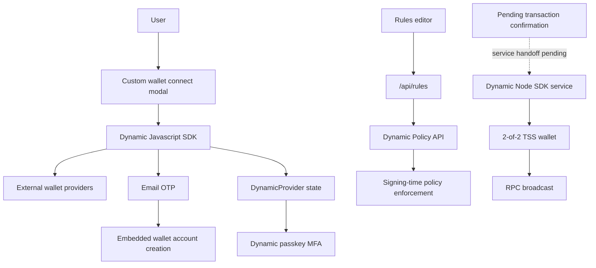
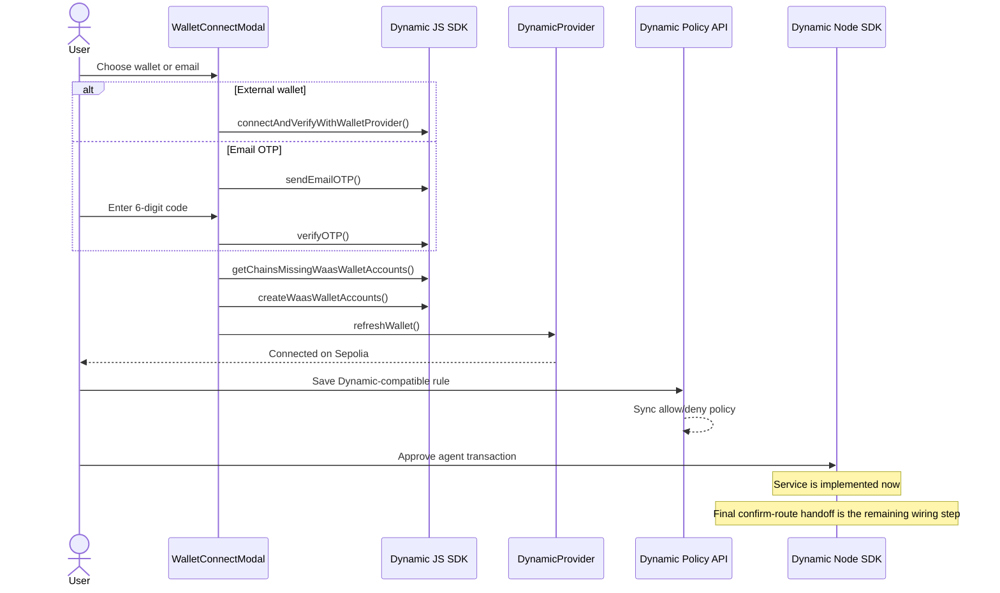

# Dynamic x VANTA

VANTA uses Dynamic as the wallet and signing control layer for agent-driven transaction safety. In this repo, Dynamic shows up in three places that matter to judges:

1. The browser uses Dynamic's Javascript SDK directly for wallet connection, embedded wallet creation, and account/session management.
2. The rules engine syncs Dynamic-compatible controls into Dynamic's Policy API so signing-time checks can live outside the app UI.
3. The backend already includes a Dynamic Node SDK service for 2-of-2 server wallet creation and transaction signing.

This is a real integration, not a logo drop. The app's wallet UX, policy sync path, and server wallet service all depend on Dynamic surfaces that are visible in source.

## ETHGlobal Cannes 2026 Prize Fit

Prize snapshot sourced from the ETHGlobal Cannes 2026 prizes page on April 5, 2026:

| Dynamic track | Prize | Why VANTA fits |
| --- | ---: | --- |
| Best use of Dynamic Node SDK | $1,667 | `backend/src/services/dynamicWallet.ts` uses `DynamicEvmWalletClient` and `ThresholdSignatureScheme.TWO_OF_TWO` for server wallet creation and signing. |
| Best use of Dynamic Javascript SDK (any framework) | $1,666 | VANTA uses Dynamic's Javascript SDK directly inside a custom React wrapper instead of relying on the React SDK abstraction. |
| Best use of Dynamic in a mobile experience | $1,667 | Not targeted in this repo. |

The Javascript SDK track is the cleanest fit here because ETHGlobal explicitly separates the JS SDK from the React SDK. VANTA aligns with that requirement by calling the JS SDK directly in `frontend/lib/dynamic/client.ts`, `frontend/lib/dynamic/context.tsx`, `frontend/components/vanta/wallet-connect-modal.tsx`, and `frontend/hooks/usePasskey.ts`.

## Judge Checklist

| Sponsor requirement | Where VANTA satisfies it |
| --- | --- |
| Use the Dynamic Javascript SDK in any framework | `createDynamicClient`, `addEvmExtension`, wallet provider connect, email OTP, WaaS account creation, passkey MFA. |
| Use the Dynamic Node SDK | `DynamicEvmWalletClient` powers `createServerWallet()` and `signAndSendTransaction()`. |
| Show a usable agentic or payments flow | VANTA is an AI transaction-approval product. Dynamic is the wallet/auth substrate around that flow. |
| Show meaningful security posture | Dynamic policy sync plus TSS server wallet service give VANTA both frontend and signing-layer controls. |

## Integration Map

## Animated Flow

## What Is Implemented

### 1. Dynamic Javascript SDK, not the React SDK

VANTA does not treat Dynamic as a generic React wallet button. The integration is built around a small custom wrapper on top of the Javascript SDK:

- `frontend/lib/dynamic/client.ts` creates a singleton Dynamic client.
- `frontend/lib/dynamic/context.tsx` manages session hydration, wallet state, logout, and Sepolia network enforcement.
- `frontend/components/vanta/wallet-connect-modal.tsx` provides a custom VANTA-branded wallet modal while still calling Dynamic SDK methods under the hood.

That architecture is important for the hackathon track because it proves the team is actually using the Javascript SDK surface directly.

### 2. Wallet connection and embedded wallet creation

The wallet modal supports both external wallets and email-based onboarding:

| Flow | Dynamic functions used | What VANTA does |
| --- | --- | --- |
| External wallet connect | `getAvailableWalletProvidersData()`, `connectAndVerifyWithWalletProvider()` | Shows available providers, deduplicates them, and connects the selected wallet. |
| Email login | `sendEmailOTP()`, `verifyOTP()` | Sends a 6-digit code and verifies the user without passwords. |
| Embedded wallet creation | `getChainsMissingWaasWalletAccounts()`, `createWaasWalletAccounts()` | Creates missing wallet accounts after either external-wallet or email auth succeeds. |
| Session hydration | `getWalletAccounts()`, `getPrimaryWalletAccount()`, `onEvent()` | Restores the active wallet when the app reloads. |

Two implementation details stand out:

- `addEvmExtension()` is called immediately after `createDynamicClient()`, which is the correct placement for EVM support.
- The app intentionally wraps Dynamic in its own UX instead of dropping in a stock modal, which makes the partner integration visible throughout onboarding.

### 3. Dynamic-backed passkey MFA

VANTA also uses Dynamic for passkey flows:

| File | Dynamic functions |
| --- | --- |
| `frontend/hooks/usePasskey.ts` | `registerPasskey()`, `getPasskeys()`, `authenticatePasskeyMFA()` |

This gives VANTA a second Dynamic security surface beyond wallet connection:

- passkey registration for biometric approval
- passkey verification before transaction confirmation
- Dynamic-managed passkey lifecycle tied to the active auth session

### 4. Policy sync into Dynamic's signing layer

VANTA's rules engine supports eight local rule types, but four of them are also projected into Dynamic's Policy API:

| VANTA rule | Dynamic policy shape |
| --- | --- |
| `per_tx_limit` | `allow` rule with `valueLimit.maxPerCall` |
| `whitelist` | `allow` rule with approved addresses |
| `contract_whitelist` | `allow` rule with approved contract addresses |
| `blacklist` | `deny` rule with blocked addresses |

Source files:

- `frontend/app/rules/page.tsx`
- `frontend/app/api/rules/route.ts`

This is the strongest "security substrate" part of the Dynamic integration because the app is not only using Dynamic for login. It is also pushing policy intent into Dynamic's own enforcement surface.

### 5. Dynamic Node SDK service

The backend service in `backend/src/services/dynamicWallet.ts` already implements:

- `createServerWallet()`
- `signAndSendTransaction()`

The service uses:

- `@dynamic-labs-wallet/node-evm`
- `@dynamic-labs-wallet/core`
- `ThresholdSignatureScheme.TWO_OF_TWO`

That means VANTA already has code for:

- authenticated Dynamic server wallet access
- 2-of-2 threshold wallet creation
- prepared transaction signing
- raw transaction broadcast via `viem`

## Execution Maturity Note

The Node SDK service is implemented, but the final handoff from the pending-confirmation route is still commented out in `frontend/app/api/transactions/confirm/[txId]/route.ts`.

That is the current state:

- implemented today: browser SDK, WaaS creation, passkey MFA, policy sync, Node SDK service
- remaining wiring: call `signAndSendTransaction()` during confirmation and persist the resulting transaction hash

This is worth stating plainly because it keeps the Dynamic story credible. The repo already proves the integration surfaces; the last step is to bind the existing service into the confirm route.

## File-Level Evidence

| File | Why it matters |
| --- | --- |
| `frontend/lib/dynamic/client.ts` | Creates the Dynamic JS client and registers EVM support. |
| `frontend/lib/dynamic/context.tsx` | Hydrates wallet state, listens for Dynamic events, and enforces Sepolia. |
| `frontend/components/vanta/wallet-connect-modal.tsx` | Real Dynamic-powered connect flow with external wallets and email OTP. |
| `frontend/hooks/usePasskey.ts` | Dynamic-managed passkey MFA. |
| `frontend/app/rules/page.tsx` | Converts VANTA rule models into Dynamic policy payloads. |
| `frontend/app/api/rules/route.ts` | Server route that proxies to Dynamic's Policy API. |
| `backend/src/services/dynamicWallet.ts` | Dynamic Node SDK service for TSS wallet creation and signing. |
| `frontend/app/api/transactions/confirm/[txId]/route.ts` | Shows where the final Node SDK execution handoff will land. |

## Environment Surface

| Variable | Used for |
| --- | --- |
| `NEXT_PUBLIC_DYNAMIC_ENV_ID` | Browser SDK init and policy route environment targeting |
| `DYNAMIC_AUTH_TOKEN` | Policy API auth and Node SDK auth |
| `DYNAMIC_ENVIRONMENT_ID` | Node SDK environment binding |
| `RPC_URL` | Broadcast target for signed transactions |
| `WALLET_PASSWORD` | Password-protected server wallet operations |

## Why This Is A Strong Dynamic Submission

The submission is strong because Dynamic is not isolated to one button or one screen:

- the Javascript SDK owns onboarding and wallet state
- WaaS gives the app passwordless embedded wallet creation
- passkeys add a second Dynamic security factor
- the Policy API projects human rules into signing-time enforcement
- the Node SDK provides the backend wallet service for controlled execution

That is exactly the kind of "wallet plus control plane" story that fits an agentic security app.

## Official References

- ETHGlobal prize page: <https://ethglobal.com/events/cannes2026/prizes>
- Dynamic Javascript docs: <https://www.dynamic.xyz/docs/javascript/introduction/welcome>
- Dynamic Node docs: <https://www.dynamic.xyz/docs/node/quickstart>
