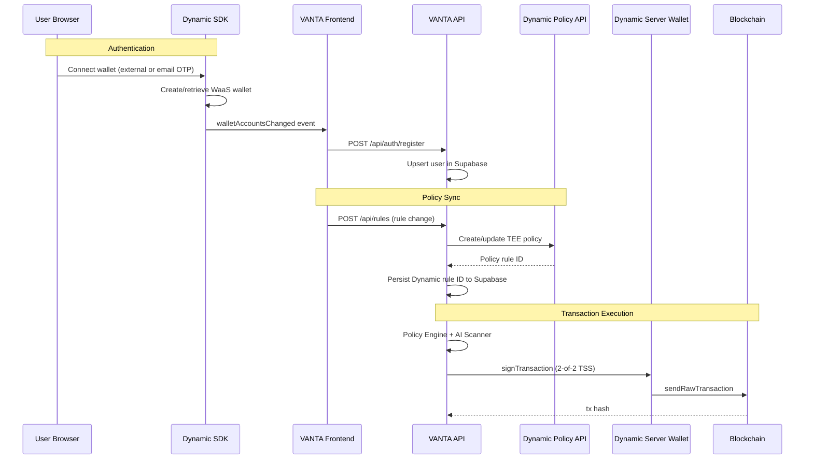
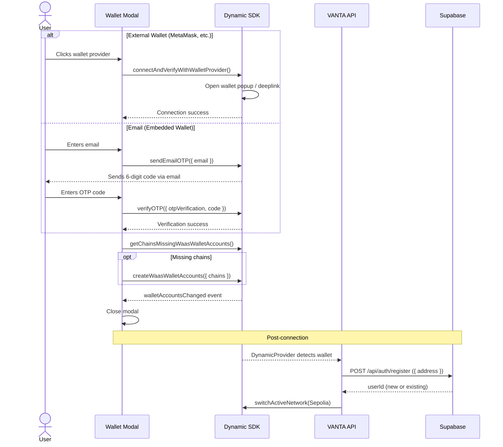
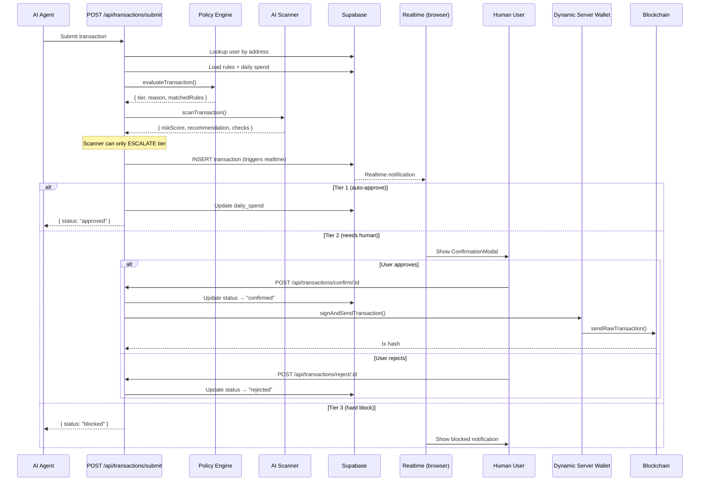

# Dynamic Integration Guide

> Complete reference for how VANTA integrates with [Dynamic](https://dynamic.xyz) for wallet authentication, embedded wallets, Wallet-as-a-Service (WaaS), TEE-enforced policy rules, and server-side threshold signing.

---

## Table of Contents

- [Overview](#overview)
- [Architecture Diagram](#architecture-diagram)
- [Frontend Integration](#frontend-integration)
  - [SDK Client Initialization](#sdk-client-initialization)
  - [DynamicProvider Context](#dynamicprovider-context)
  - [Wallet Connection Modal](#wallet-connection-modal)
  - [Network Management](#network-management)
  - [User Registration Flow](#user-registration-flow)
- [WaaS (Wallet-as-a-Service)](#waas-wallet-as-a-service)
  - [Embedded Wallet Creation](#embedded-wallet-creation)
  - [Email OTP Authentication](#email-otp-authentication)
  - [External Wallet Providers](#external-wallet-providers)
- [Policy API Integration](#policy-api-integration)
  - [How Rules Sync Works](#how-rules-sync-works)
  - [Rule-to-Policy Mapping](#rule-to-policy-mapping)
  - [Create & Update Policies](#create--update-policies)
  - [Delete Policies](#delete-policies)
  - [Bidirectional Rule ID Tracking](#bidirectional-rule-id-tracking)
- [Backend Server Wallet](#backend-server-wallet)
  - [2-of-2 Threshold Signature Scheme](#2-of-2-threshold-signature-scheme)
  - [Wallet Creation](#wallet-creation)
  - [Transaction Signing & Broadcasting](#transaction-signing--broadcasting)
  - [MPC Accelerator (Production)](#mpc-accelerator-production)
- [Environment Variables](#environment-variables)
- [Authentication Flow Sequence](#authentication-flow-sequence)
- [Transaction Lifecycle with Dynamic](#transaction-lifecycle-with-dynamic)
- [Error Handling](#error-handling)
- [Security Considerations](#security-considerations)
- [SDK Version Reference](#sdk-version-reference)

---

## Overview

VANTA uses Dynamic at **three layers**:

| Layer | Dynamic Feature | Purpose |
|-------|----------------|---------|
| **Frontend** | Vanilla JS SDK (`@dynamic-labs-sdk/client` + `@dynamic-labs-sdk/evm`) | Wallet connection, auth, account management |
| **API** | Policy API (REST) | Sync user-defined rules to TEE-enforced signing policies |
| **Backend** | Wallet SDK (`@dynamic-labs-wallet/node-evm`) | Server-side 2-of-2 threshold signature wallet |

> **⚠️ Important:** VANTA does **not** use Dynamic's React SDK (`@dynamic-labs/sdk-react-core`) or `@dynamic-labs/ethereum`. While both appear in `package.json`, they are **never imported** in source code. The frontend is built entirely on Dynamic's framework-agnostic vanilla JavaScript SDK (`@dynamic-labs-sdk/client`), with a custom React context wrapper built in-house.

```
User ──► Dynamic SDK (browser) ──► Wallet Connected
                                         │
                                         ├──► Supabase (user registration)
                                         │
Rules Page ──► VANTA Rules DB ──► Dynamic Policy API (TEE)
                                         │
Agent Submit ──► Policy Engine ──► Dynamic Server Wallet (TSS) ──► Blockchain
```

---

## Architecture Diagram



---

## Frontend Integration

> **SDK choice:** VANTA uses Dynamic's **vanilla JavaScript SDK** (`@dynamic-labs-sdk/client`) rather than the React SDK (`@dynamic-labs/sdk-react-core`). This is intentional — it gives VANTA full control over the wallet lifecycle and allows a custom React context that integrates tightly with the app's state management, Supabase, and network switching logic.

### SDK Client Initialization

**File:** `frontend/lib/dynamic/client.ts`

The Dynamic client is initialized as a **singleton** with lazy instantiation. The EVM extension is registered immediately after creation, as required by the SDK.

```typescript
import { createDynamicClient } from '@dynamic-labs-sdk/client';
import { addEvmExtension } from '@dynamic-labs-sdk/evm';

let _client: ReturnType<typeof createDynamicClient> | null = null;

export function getDynamicClient() {
  // Server-side guard — Dynamic is client-only
  if (typeof window === 'undefined') return null;

  if (!_client) {
    _client = createDynamicClient({
      environmentId: process.env.NEXT_PUBLIC_DYNAMIC_ENV_ID!,
      metadata: {
        name: 'VANTA',
      },
    });

    // MUST be registered immediately after createDynamicClient
    addEvmExtension();
  }

  return _client;
}
```

**Key design decisions:**

1. **SSR guard** — Returns `null` on the server to prevent hydration errors.
2. **Singleton pattern** — Only one client instance exists per page lifecycle.
3. **Immediate extension registration** — `addEvmExtension()` must be called before the SDK completes initialization, so it's placed directly after `createDynamicClient`.
4. **Environment ID** — Loaded from `NEXT_PUBLIC_DYNAMIC_ENV_ID` (public, safe for client bundle).

---

### DynamicProvider Context

**File:** `frontend/lib/dynamic/context.tsx`

A React context wraps the entire application, providing wallet state and connection controls to all components.

```typescript
export interface DynamicState {
  wallet: WalletAccount | null;     // Active wallet account
  isConnected: boolean;             // Whether a wallet is connected
  isReady: boolean;                 // Whether the SDK has finished initializing
  connect: () => void;              // Opens the wallet connect modal
  disconnect: () => Promise<void>;  // Disconnects and clears state
  showConnectModal: boolean;        // Controls the modal visibility
  setShowConnectModal: (v: boolean) => void;
}
```

**Initialization sequence:**

```
1. Component mounts
2. getDynamicClient() creates/returns SDK instance
3. getWalletAccounts() hydrates existing session (synchronous)
4. getPrimaryWalletAccount() selects the active account
5. setWallet(primary) → immediate state update
6. setIsReady(true) → UI can render
7. ensureSepolia(primary) → auto-switch to Sepolia testnet
8. registerUser(primary.address) → POST /api/auth/register
9. onEvent('walletAccountsChanged') → subscribe to future changes
```

**Sepolia auto-switching:**

VANTA runs on Sepolia testnet. When a wallet connects, the provider automatically attempts to switch the active network:

```typescript
const SEPOLIA_NETWORK_ID = '11155111';

async function ensureSepolia(walletAccount: WalletAccount) {
  const { networkId } = await getActiveNetworkId({ walletAccount });
  if (networkId !== SEPOLIA_NETWORK_ID) {
    await switchActiveNetwork({ networkId: SEPOLIA_NETWORK_ID, walletAccount });
  }
}
```

This uses a try/catch because some wallet providers don't support programmatic network switching.

**Auto-registration:**

On connect, the provider fires a `POST /api/auth/register` to create the user record in Supabase if it doesn't already exist. The `useUser` hook also handles this as a fallback (double-registration is idempotent via `address UNIQUE` constraint).

---

### Wallet Connection Modal

**File:** `frontend/components/vanta/wallet-connect-modal.tsx`

VANTA uses a **custom-built connection modal** instead of Dynamic's built-in UI. This gives full control over the UX while using Dynamic's SDK functions underneath.

**Three flows within the modal:**

```
┌─────────────────────────────────────────────┐
│             WALLET CONNECT MODAL            │
│                                             │
│  ┌───────────┐   ┌──────────┐   ┌────────┐ │
│  │ PROVIDERS │──►│  EMAIL   │──►│  OTP   │ │
│  │           │   │  INPUT   │   │ VERIFY │ │
│  │ • Email   │   │          │   │        │ │
│  │ • MetaMask│   │ Enter    │   │ 6-digit│ │
│  │ • Coinbase│   │ email    │   │ code   │ │
│  │ • WC      │   │ → send   │   │ → auth │ │
│  └───────────┘   └──────────┘   └────────┘ │
│                                             │
│  Footer: "Powered by Dynamic · Secured by  │
│           VANTA"                            │
└─────────────────────────────────────────────┘
```

**Dynamic SDK functions used:**

| Function | Purpose |
|----------|---------|
| `getAvailableWalletProvidersData()` | Lists available wallet providers (synchronous) |
| `connectAndVerifyWithWalletProvider()` | Connect an external wallet (MetaMask, Coinbase, etc.) |
| `sendEmailOTP()` | Send a 6-digit OTP to an email address |
| `verifyOTP()` | Verify the OTP and authenticate the user |
| `getChainsMissingWaasWalletAccounts()` | Check if WaaS wallets need creation |
| `createWaasWalletAccounts()` | Create embedded wallets for missing chains |

**Provider deduplication:**

The SDK may return duplicate providers. The modal deduplicates by `groupKey`:

```typescript
const seen = new Set<string>();
const unique = data.filter((p) => {
  if (seen.has(p.groupKey)) return false;
  seen.add(p.groupKey);
  return true;
});
```

**WaaS wallet auto-creation:**

After any successful connection (external or email), the modal checks for and creates any missing WaaS wallet accounts:

```typescript
const missing = getChainsMissingWaasWalletAccounts();
if (missing.length > 0) {
  await createWaasWalletAccounts({ chains: missing });
}
```

---

### Network Management

VANTA targets Ethereum Sepolia (chain ID `11155111`). The `DynamicProvider` enforces this on every wallet connection event:

```
Wallet connects → getActiveNetworkId()
                       │
                       ├── Already on Sepolia → ✅ No action
                       │
                       └── On different network → switchActiveNetwork()
                                                         │
                                                         ├── Success → ✅
                                                         └── Unsupported → Silently fail
```

---

### User Registration Flow

When a wallet connects, the user is registered via two paths (for redundancy):

**Path 1: DynamicProvider context** (`frontend/lib/dynamic/context.tsx`)

```typescript
async function registerUser(address: string) {
  await fetch('/api/auth/register', {
    method: 'POST',
    headers: { 'Content-Type': 'application/json' },
    body: JSON.stringify({ address }),
  });
}
```

**Path 2: useUser hook** (`frontend/hooks/useUser.ts`)

The `useUser` hook queries Supabase for the user. If not found (Supabase error code `PGRST116`), it calls the same register endpoint:

```typescript
if (error?.code === 'PGRST116' || !data) {
  const res = await fetch('/api/auth/register', {
    method: 'POST',
    headers: { 'Content-Type': 'application/json' },
    body: JSON.stringify({ address, protectionLevel: 'balanced' }),
  });
}
```

Both paths are idempotent — the `address UNIQUE` constraint in `users` table prevents duplicates.

---

## WaaS (Wallet-as-a-Service)

### Embedded Wallet Creation

Dynamic's WaaS creates non-custodial embedded wallets for users who authenticate via email OTP. These wallets:

- Are created automatically after OTP verification
- Use threshold signature schemes (keys split between user device and Dynamic infrastructure)
- Support multiple chains simultaneously

**Creation trigger in VANTA:**

```typescript
// After OTP verification
const missing = getChainsMissingWaasWalletAccounts();
await createWaasWalletAccounts({ chains: missing });
```

### Email OTP Authentication

The complete email authentication flow:

```
1. User enters email
2. sendEmailOTP({ email })
   → Dynamic sends 6-digit code to email
   → Returns OTPVerification object

3. User enters code
4. verifyOTP({ otpVerification, verificationToken: code })
   → Dynamic verifies code
   → Creates/retrieves user session
   → Returns authentication token

5. createWaasWalletAccounts({ chains })
   → Creates embedded wallets for all supported chains
   → Wallet appears via walletAccountsChanged event
```

### External Wallet Providers

External wallets (MetaMask, Coinbase, WalletConnect) connect via:

```typescript
await connectAndVerifyWithWalletProvider({
  walletProviderKey: provider.key  // e.g., "metamask", "coinbase"
});
```

The provider key comes from `getAvailableWalletProvidersData()`, which lists providers configured in the Dynamic dashboard.

---

## Policy API Integration

### How Rules Sync Works

VANTA has a **dual-enforcement** model:

1. **Supabase (primary)** — All rules stored in the `rules` table, evaluated by the VANTA Policy Engine on every transaction
2. **Dynamic Policy API (secondary)** — Compatible rules are additionally synced to Dynamic's TEE for signing-time enforcement

```
┌─────────────────────────────────────────────────────┐
│                  RULE LIFECYCLE                      │
│                                                     │
│  User creates/edits rule in UI                      │
│         │                                           │
│         ├──► 1. Save to Supabase (rules table)      │
│         │                                           │
│         └──► 2. If Dynamic-compatible:              │
│                  POST /api/rules → Dynamic API      │
│                  Save returned rule ID back          │
│                  to Supabase config.dynamic_rule_id  │
│                                                     │
│  On transaction submit:                             │
│  ├── VANTA Policy Engine evaluates ALL rules        │
│  └── Dynamic TEE enforces synced rules at signing   │
└─────────────────────────────────────────────────────┘
```

### Rule-to-Policy Mapping

Only four rule types are compatible with Dynamic's Policy API:

| VANTA Rule Type | Dynamic Policy Fields | Policy Type |
|----------------|----------------------|-------------|
| `per_tx_limit` | `valueLimit.maxPerCall` | `allow` |
| `whitelist` | `addresses[]` | `allow` |
| `contract_whitelist` | `addresses[]` (resolved contract addresses) | `allow` |
| `blacklist` | `addresses[]` | `deny` |

Rules tagged with a ⚡ "Dynamic" badge in the UI indicate TEE enforcement.

**Mapping function** (`frontend/app/rules/page.tsx`):

```typescript
function toDynamicPolicy(rule: DbRule) {
  if (rule.type === "per_tx_limit") {
    return {
      chain: "EVM",
      chainIds: [1],
      name: "Per-transaction limit",
      ruleType: "allow",
      addresses: [],
      valueLimit: {
        maxPerCall: String(Math.round((rule.config?.amount ?? 0) * 1e18))
      },
    };
  }

  if (rule.type === "whitelist") {
    const addrs = (rule.config?.addresses ?? []).map(a => a.address);
    return {
      chain: "EVM",
      chainIds: [1],
      name: "Trusted addresses",
      ruleType: "allow",
      addresses: addrs,
    };
  }

  if (rule.type === "contract_whitelist") {
    const contracts = (rule.config?.contracts ?? []) as string[];
    // Resolve contract names to addresses using known mapping
    const addresses = contracts.flatMap(c => CONTRACT_ADDRESSES[c] ?? []);
    return {
      chain: "EVM",
      chainIds: [1],
      name: "Approved contracts",
      ruleType: "allow",
      addresses,
    };
  }

  if (rule.type === "blacklist") {
    const addrs = (rule.config?.addresses ?? []).map(a => a.address);
    return {
      chain: "EVM",
      chainIds: [1],
      name: "Blocked addresses",
      ruleType: "deny",
      addresses: addrs,
    };
  }

  return null; // Not compatible with Dynamic
}
```

**Known contract addresses** used for `contract_whitelist` resolution:

| Protocol | Contract Address |
|----------|-----------------|
| Uniswap V3 | `0xE592427A0AEce92De3Edee1F18E0157C05861564` |
| Uniswap V2 | `0x68b3465833fb72A70ecDF485E0e4C7bD8665Fc45` |
| Aave V3 | `0x87870Bca3F3fD6335C3F4ce8392D69350B4fA4E2` |
| Compound | `0xc3d688B66703497DAA19211EEdff47f25384cdc3` |
| 1inch | `0x1111111254EEB25477B68fb85Ed929f73A960582` |
| Lido | `0xae7ab96520DE3A18E5e111B5EaAb095312D7fE84` |
| Curve | `0xD533a949740bb3306d119CC777fa900bA034cd52` |

### Create & Update Policies

**Endpoint:** `POST /api/rules`

**File:** `frontend/app/api/rules/route.ts`

The API route proxies requests to Dynamic's Policy API:

```
Dynamic API URL:
https://app.dynamicauth.com/api/v0/environments/{ENV_ID}/waas/policies
```

**Request body:**

```json
// Create new rules
{
  "rulesToAdd": [{
    "chain": "EVM",
    "chainIds": [1],
    "name": "Per-transaction limit",
    "ruleType": "allow",
    "addresses": [],
    "valueLimit": { "maxPerCall": "200000000000000000000" }
  }]
}

// Update existing rules
{
  "rulesToUpdate": [{
    "id": "existing-rule-uuid",
    "chain": "EVM",
    "chainIds": [1],
    "name": "Per-transaction limit",
    "ruleType": "allow",
    "addresses": [],
    "valueLimit": { "maxPerCall": "500000000000000000000" }
  }]
}
```

**Method selection logic:**

```typescript
const method = rulesToUpdate.length && !rulesToAdd.length ? 'PUT' : 'POST';
```

### Delete Policies

**Endpoint:** `DELETE /api/rules`

```json
{
  "ruleIdsToDelete": ["uuid-1", "uuid-2"]
}
```

### Bidirectional Rule ID Tracking

When a rule is created in Dynamic, the returned ID is persisted back to the Supabase `rules.config` field:

```typescript
// After syncing to Dynamic
const returnedId = await syncWithDynamic(rule);

// Persist back to Supabase
if (returnedId && !config.dynamic_rule_id) {
  await updateConfig(id, { ...config, dynamic_rule_id: returnedId });
}
```

This enables:
- **Updates** — Finding the existing Dynamic rule when a user edits their VANTA rule
- **Deletes** — Removing the correct Dynamic rule when a user deletes their VANTA rule

---

## Backend Server Wallet

### 2-of-2 Threshold Signature Scheme

**File:** `backend/src/services/dynamicWallet.ts`

The backend creates and uses **2-of-2 TSS (Threshold Signature Scheme)** wallets through Dynamic's Node.js SDK. This means:

- The private key is **never reconstructed** in any single location
- Two key shares must cooperate to produce a valid signature
- One share lives on Dynamic's infrastructure, the other on the VANTA backend

```
┌───────────────────────────────────────────────┐
│          2-of-2 THRESHOLD SIGNING             │
│                                               │
│  ┌──────────────┐      ┌──────────────────┐   │
│  │ VANTA Server │      │  Dynamic Infra   │   │
│  │              │      │                  │   │
│  │  Key Share 1 │ ◄──► │  Key Share 2     │   │
│  │              │      │                  │   │
│  │  Signs with  │      │  Signs with      │   │
│  │  password    │      │  internal auth   │   │
│  └──────────────┘      └──────────────────┘   │
│         │                     │               │
│         └─────────┬───────────┘               │
│                   ▼                           │
│         ┌──────────────────┐                  │
│         │ Combined sig →   │                  │
│         │ valid ECDSA      │                  │
│         │ signature        │                  │
│         └──────────────────┘                  │
└───────────────────────────────────────────────┘
```

### Wallet Creation

```typescript
import { DynamicEvmWalletClient } from '@dynamic-labs-wallet/node-evm';
import { ThresholdSignatureScheme } from '@dynamic-labs-wallet/core';

const client = new DynamicEvmWalletClient({
  environmentId: process.env.DYNAMIC_ENVIRONMENT_ID!,
  enableMPCAccelerator: false, // Only enable on AWS Nitro Enclaves
});

await client.authenticateApiToken(process.env.DYNAMIC_AUTH_TOKEN!);

const wallet = await client.createWalletAccount({
  thresholdSignatureScheme: ThresholdSignatureScheme.TWO_OF_TWO,
  password: process.env.WALLET_PASSWORD,
  backUpToClientShareService: true,
  onError: (error: Error) => {
    console.error('Wallet creation error:', error);
  },
});
```

**Parameters:**

| Parameter | Value | Explanation |
|-----------|-------|-------------|
| `thresholdSignatureScheme` | `TWO_OF_TWO` | Both shares required for signing |
| `password` | Server secret | Encrypts the server's key share |
| `backUpToClientShareService` | `true` | Backs up the server share for recovery |
| `enableMPCAccelerator` | `false` | Set `true` only on AWS Nitro Enclaves |

### Transaction Signing & Broadcasting

The full signing flow:

```typescript
export async function signAndSendTransaction(
  senderAddress: string,
  to: string,
  value: string,
  data?: string
) {
  const client = await getClient();

  // 1. Create a public client for gas estimation
  const publicClient = client.createViemPublicClient({
    chain: mainnet,
    rpcUrl: process.env.RPC_URL!,
  });

  // 2. Prepare the transaction (gas estimation, nonce)
  const preparedTx = await publicClient.prepareTransactionRequest({
    to: to as `0x${string}`,
    value: BigInt(value),
    data: data as `0x${string}` | undefined,
    account: senderAddress as `0x${string}`,
    chain: mainnet,
  });

  // 3. Sign with 2-of-2 TSS (requires password)
  const signedTx = await client.signTransaction({
    senderAddress: senderAddress as `0x${string}`,
    transaction: preparedTx,
    password: process.env.WALLET_PASSWORD,
  });

  // 4. Broadcast the raw signed transaction
  const walletClient = createWalletClient({
    chain: mainnet,
    transport: http(process.env.RPC_URL!),
    account: senderAddress as `0x${string}`,
  });

  const txHash = await walletClient.sendRawTransaction({
    serializedTransaction: signedTx,
  });

  return txHash;
}
```

### MPC Accelerator (Production)

For production deployments on AWS Nitro Enclaves, enable the MPC accelerator:

```typescript
const client = new DynamicEvmWalletClient({
  environmentId: process.env.DYNAMIC_ENVIRONMENT_ID!,
  enableMPCAccelerator: true, // ← Production only
});
```

This runs the signing computation inside a hardware-attested enclave, ensuring:
- Key shares never leave the TEE
- The server operator cannot extract private keys
- Signing is cryptographically verifiable

---

## Environment Variables

### Frontend (`frontend/.env.local`)

| Variable | Type | Required | Description |
|----------|------|----------|-------------|
| `NEXT_PUBLIC_DYNAMIC_ENV_ID` | Public | ✅ | Dynamic environment ID (safe for client) |
| `DYNAMIC_AUTH_TOKEN` | Server | ✅ | Dynamic API bearer token (server-side only) |
| `NEXT_PUBLIC_SUPABASE_URL` | Public | ✅ | Supabase project URL |
| `NEXT_PUBLIC_SUPABASE_ANON_KEY` | Public | ✅ | Supabase anonymous key (RLS-protected) |
| `SUPABASE_SERVICE_ROLE_KEY` | Server | ✅ | Supabase service role key (bypasses RLS) |
| `NEXT_PUBLIC_SITE_URL` | Public | ❌ | Production URL for Open Graph metadata |

### Backend (`backend/.env`)

| Variable | Type | Required | Description |
|----------|------|----------|-------------|
| `DYNAMIC_ENVIRONMENT_ID` | Server | ✅ | Dynamic environment ID |
| `DYNAMIC_AUTH_TOKEN` | Server | ✅ | Dynamic API bearer token |
| `WALLET_PASSWORD` | Server | ✅ | Encryption password for server key shares |
| `RPC_URL` | Server | ✅ | Ethereum JSON-RPC endpoint |

> ⚠️ **Security:** `DYNAMIC_AUTH_TOKEN`, `SUPABASE_SERVICE_ROLE_KEY`, and `WALLET_PASSWORD` must **never** be exposed to the client. They are used only in Next.js API routes (server-side) and the Node.js backend.

---

## Authentication Flow Sequence



---

## Transaction Lifecycle with Dynamic



---

## Error Handling

### Frontend SDK Errors

| Error | Cause | Handling |
|-------|-------|---------|
| Connection failed | User rejected wallet popup | Display error in modal, allow retry |
| OTP send failed | Invalid email or rate limit | Display error, allow retry |
| Invalid OTP code | Wrong code entered | Display "Invalid code. Please try again." |
| Network switch unsupported | Wallet doesn't support `wallet_switchEthereumChain` | Silently catch (non-fatal) |

### API Errors

| Status | Endpoint | Cause |
|--------|----------|-------|
| `400` | `/api/transactions/submit` | Missing `from`, `to`, or `value` |
| `404` | `/api/transactions/submit` | User not registered (no matching address) |
| `500` | `/api/transactions/submit` | Database insert failed |
| `4xx/5xx` | `/api/rules` | Dynamic Policy API rejection (proxied status) |

### Backend Wallet Errors

```typescript
onError: (error: Error) => {
  console.error('Wallet creation error:', error);
}
```

Common errors:
- Invalid `DYNAMIC_AUTH_TOKEN` — authentication fails
- Invalid `WALLET_PASSWORD` — signing fails
- RPC endpoint down — transaction preparation fails

---

## Security Considerations

1. **Server-side secrets** — `DYNAMIC_AUTH_TOKEN` and `WALLET_PASSWORD` are only used in Next.js API routes and the Node.js backend. They are never sent to the browser.

2. **Policy API authentication** — All Dynamic Policy API calls include a `Bearer` token in the `Authorization` header. This token is stored in `process.env.DYNAMIC_AUTH_TOKEN` (server-side only).

3. **Tier escalation invariant** — The AI scanner can only **escalate** a transaction's tier (e.g., Tier 1 → Tier 2, Tier 2 → Tier 3). It can never downgrade. This prevents any prompt injection or adversarial input from bypassing security checks.

4. **TEE enforcement** — Dynamic-compatible rules (per-tx limit, whitelist, blacklist, contract whitelist) are enforced in Dynamic's Trusted Execution Environment at signing time, providing hardware-level guarantees.

5. **2-of-2 TSS** — The server wallet uses a 2-of-2 threshold signature scheme. Neither the VANTA backend nor Dynamic can independently produce a valid signature.

6. **Idempotent registration** — The `users.address UNIQUE` constraint ensures that duplicate registration attempts are harmless.

---

## SDK Version Reference

### Frontend (actively imported in source code)

| Package | Version | Imported In | Purpose |
|---------|---------|-------------|---------|
| `@dynamic-labs-sdk/client` | `^0.23.2` | `client.ts`, `context.tsx`, `wallet-connect-modal.tsx` | Core vanilla JS SDK — `createDynamicClient`, auth, wallet management |
| `@dynamic-labs-sdk/client/waas` | `^0.23.2` | `wallet-connect-modal.tsx` | WaaS functions — `getChainsMissingWaasWalletAccounts`, `createWaasWalletAccounts` |
| `@dynamic-labs-sdk/evm` | `^0.23.2` | `client.ts` | EVM chain extension — `addEvmExtension` |

### Frontend (in `package.json` but NOT imported — unused)

| Package | Version | Notes |
|---------|---------|-------|
| `@dynamic-labs/sdk-react-core` | `^4.75.0` | ❌ Never imported. VANTA uses the vanilla JS SDK instead. |
| `@dynamic-labs/ethereum` | `^4.75.0` | ❌ Never imported. EVM support comes via `@dynamic-labs-sdk/evm`. |

> These two packages may be vestigial from an earlier integration approach. They can safely be removed from `package.json` without affecting functionality.

### Backend

| Package | Version | Purpose |
|---------|---------|---------|
| `@dynamic-labs-wallet/core` | `^0.0.322` | Core wallet types (`ThresholdSignatureScheme`) |
| `@dynamic-labs-wallet/node-evm` | `^0.0.322` | Server-side EVM wallet client (`DynamicEvmWalletClient`) |
| `viem` | `^2.47.6` | Transaction preparation, wallet client, RPC |

---

## File Reference

| File | Purpose |
|------|---------|
| `frontend/lib/dynamic/client.ts` | Singleton Dynamic SDK client initialization |
| `frontend/lib/dynamic/context.tsx` | React context provider with wallet state management |
| `frontend/components/vanta/wallet-connect-modal.tsx` | Custom wallet connection UI (email OTP + external wallets) |
| `frontend/app/providers.tsx` | Root provider composition (DynamicProvider + WalletConnectModal) |
| `frontend/app/api/rules/route.ts` | Dynamic Policy API proxy (create, update, delete rules) |
| `frontend/app/rules/page.tsx` | Rules editor with Dynamic policy sync logic |
| `frontend/hooks/useUser.ts` | User state hook with auto-registration |
| `backend/src/services/dynamicWallet.ts` | Server-side TSS wallet creation and signing |
