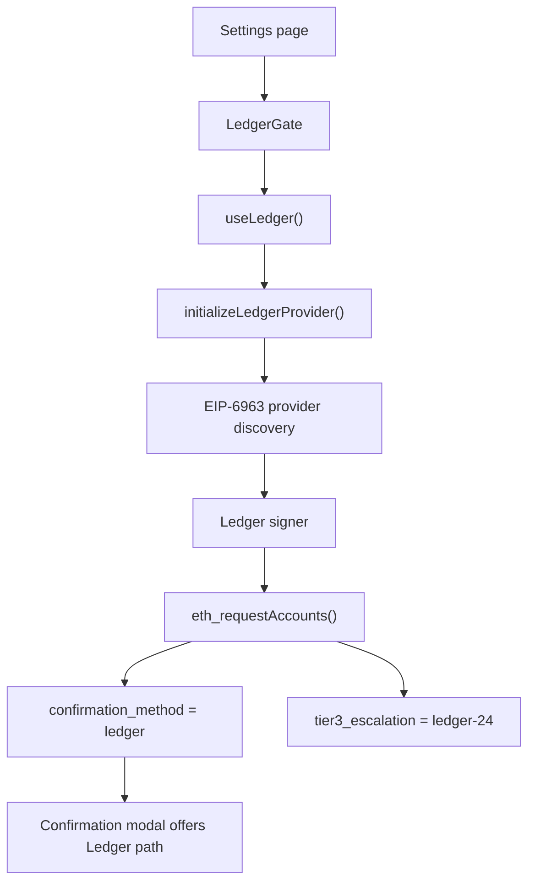
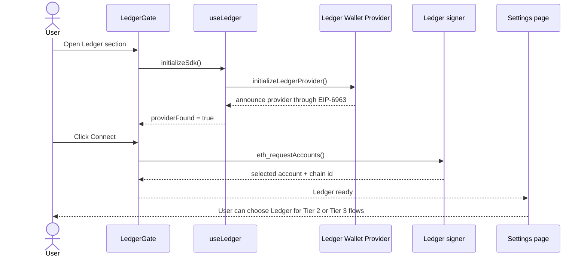

# Ledger x VANTA

VANTA uses Ledger as the human trust layer for agent-driven transactions. The product thesis is simple: if an autonomous system wants to move funds or escalate permissions, the human should have a hardware-backed way to step in.

In this repo, Ledger is integrated through Ledger Wallet Provider and surfaced as:

- a dedicated hardware-wallet setup flow in Settings
- a confirmation-method option for Tier 2 transactions
- a Tier 3 escalation option for higher-risk transactions
- a browser/device capability gate that keeps the UX honest about hardware requirements

That makes VANTA a clean fit for the Ledger tracks centered on AI agents and wallet integrations.

## ETHGlobal Cannes 2026 Prize Fit

Prize snapshot sourced from the ETHGlobal Cannes 2026 prizes page on April 5, 2026:

| Ledger track | Prize | Why VANTA fits |
| --- | ---: | --- |
| AI Agents x Ledger | $6,000 | VANTA is an AI transaction-approval product and uses Ledger as a human-in-the-loop trust layer for sensitive actions. |
| Clear Signing, Integrations & Apps | $4,000 | The repo embeds Ledger Wallet Provider directly into the app flow and guides users through hardware-wallet setup inside the product. |

The primary fit is `AI Agents x Ledger`. The secondary fit is the integration track because VANTA uses `@ledgerhq/ledger-wallet-provider` directly.

## Judge Checklist

| Sponsor requirement | Where VANTA satisfies it |
| --- | --- |
| Use Ledger as the trust layer for AI | Settings and approval flows let users designate Ledger as the confirmation method for agent-triggered transactions. |
| Human-in-the-loop approvals for risky actions | The app surfaces Ledger as a Tier 2 method and a Tier 3 escalation option. |
| Extend Ledger support inside an app flow | `frontend/hooks/useLedger.ts` bootstraps Ledger Wallet Provider and `frontend/components/vanta/ledger-gate.tsx` exposes it in-product. |
| Build a serious wallet integration, not just a mention | The integration handles provider discovery, account connection, browser support checks, and environment setup. |

## System Map

## Animated Flow

## What Is Implemented

### 1. Ledger Wallet Provider bootstrapping

`frontend/hooks/useLedger.ts` does the heavy lifting:

- dynamically imports `@ledgerhq/ledger-wallet-provider` to avoid SSR issues
- dynamically imports Ledger styles
- checks browser support for Web HID or Web Bluetooth
- initializes the SDK with `dAppIdentifier` and optional `apiKey`
- listens for `eip6963:announceProvider`
- requests providers with `eip6963:requestProvider`

This is real integration work, not a static sponsor card.

### 2. Provider discovery and account connection

The hook filters EIP-6963 providers down to Ledger-specific entries by checking:

- `rdns` contains `com.ledger`
- or the provider name includes `ledger`

Once the provider is found, VANTA calls:

- `eth_requestAccounts`
- `eth_chainId`

That gives the app:

- the selected Ledger-backed account
- the current chain id
- connection state it can surface in the UI

### 3. In-product hardware-wallet UX

`frontend/components/vanta/ledger-gate.tsx` is the judge-facing part of the integration:

- browser support banner when Web HID / Bluetooth is unavailable
- ready state when a Ledger signer is discovered
- connect button when the provider is available
- environment guidance when no Ledger API key is present
- explicit hardware setup steps for USB/Bluetooth, device unlock, and Ethereum app open

This matters because sponsor judges can see the Ledger integration from inside the product instead of inferring it from package.json.

### 4. Ledger as a transaction-approval option

The Settings page treats Ledger as a first-class approval method:

| Surface | File | Evidence |
| --- | --- | --- |
| Hardware-wallet setup | `frontend/app/settings/page.tsx` | Dedicated "Ledger - Hardware Signer" section with `LedgerGate`. |
| Tier 2 confirmation method | `frontend/app/settings/page.tsx` | `confirmation_method = "ledger"` is a selectable option. |
| Tier 3 escalation policy | `frontend/app/settings/page.tsx` | `ledger-24` appears as an escalation option. |
| Modal labeling | `frontend/components/vanta/confirmation-modal.tsx` | "Confirm with Ledger" is a visible approval path. |

This is why the AI Agents x Ledger track is a credible target. VANTA is literally centered on agent-initiated actions that need human confirmation.

## Browser And Device Constraints

The integration is explicit about Ledger's real-world constraints:

| Check | Current behavior |
| --- | --- |
| No Web HID or Web Bluetooth | Show unsupported-browser warning |
| Desktop Chrome / Edge / Brave | Supported path |
| Missing `NEXT_PUBLIC_LEDGER_API_KEY` in development | Enable SDK stub mode so the UI still renders |
| Missing `NEXT_PUBLIC_LEDGER_API_KEY` outside development | Show production warning with Ledger partner-program link |

That is good sponsor-facing behavior because it avoids pretending hardware support is universal.

## Execution Maturity Note

The current repo is strongest on wallet-provider integration and on making Ledger the visible trust layer in the approval UX.

The remaining hardening step is to bind the pending confirmation path to a device-backed signature or approval challenge. Today:

- the Ledger provider connection flow is implemented
- Ledger is stored as a selected approval method
- the confirmation route records the chosen method through `confirmed_method`

What is not yet wired is a dedicated device-signature request inside the confirmation route before execution.

That note is important because it keeps the Ledger story accurate. The integration surface is real and judge-visible; the next step is to attach the connected provider to the final execution handshake.

## File-Level Evidence

| File | Why it matters |
| --- | --- |
| `frontend/hooks/useLedger.ts` | Ledger SDK bootstrap, provider discovery, and connection logic. |
| `frontend/components/vanta/ledger-gate.tsx` | User-facing Ledger setup and readiness UX. |
| `frontend/app/settings/page.tsx` | Makes Ledger selectable for confirmation and Tier 3 escalation. |
| `frontend/components/vanta/confirmation-modal.tsx` | Surfaces Ledger as a transaction-confirmation path. |
| `frontend/hooks/useUser.ts` | Persists the selected confirmation method and escalation preference. |

## Environment Surface

| Variable | Used for |
| --- | --- |
| `NEXT_PUBLIC_LEDGER_API_KEY` | Production Ledger Wallet Provider auth |
| `NEXT_PUBLIC_LEDGER_DAPP_IDENTIFIER` | Dapp identifier passed to `initializeLedgerProvider()` |

## Why This Is A Strong Ledger Submission

The submission is strong because the Ledger integration is aligned with Ledger's trust-layer story:

- AI agents initiate the risky action
- the human can choose a hardware-backed approval path
- the wallet-provider integration is embedded directly inside the application
- the UX tells the truth about browser support and setup requirements

That is much closer to a real safety product than a generic wallet-connection demo.

## Official References

- ETHGlobal prize page: <https://ethglobal.com/events/cannes2026/prizes>
- Ledger ETHGlobal tracks: <https://developers.ledger.com/ethglobal>
- Ledger Wallet Provider overview: <https://developers.ledger.com/docs/ledger-wallet-provider/overview>
