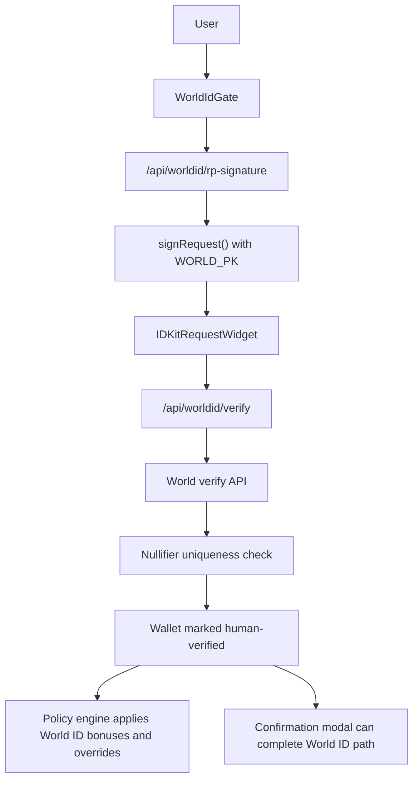
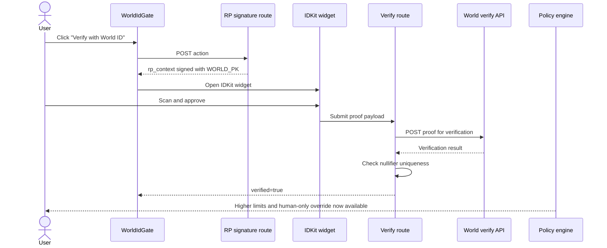
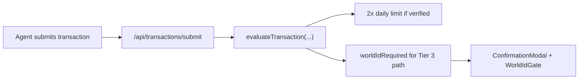

# World ID x VANTA

VANTA uses World ID as a real transaction constraint, not as a profile badge. In this repo, World ID changes what the product will allow:

- verified humans get a larger effective daily limit
- Tier 3 transactions can require World ID before they can move forward
- proof verification happens on the backend, not only in the browser
- nullifiers are checked for uniqueness so one human cannot replay the same proof across wallets for the same action

That maps directly to the World ID 4.0 track at ETHGlobal Cannes 2026.

## ETHGlobal Cannes 2026 Prize Fit

Prize snapshot sourced from the ETHGlobal Cannes 2026 prizes page on April 5, 2026:

| World track | Prize | VANTA status |
| --- | ---: | --- |
| Best use of Agent Kit | $8,000 | Not targeted in this repo. |
| Best use of World ID 4.0 | $8,000 | Primary target. VANTA uses World ID as a hard safety constraint inside the transaction pipeline. |
| Best use of MiniKit 2.0 | $4,000 | Not targeted in this repo. |

The World ID track asks for two things that matter here:

1. World ID must be a real product constraint around eligibility, uniqueness, fairness, reputation, or rate limits.
2. Proof validation must happen in a web backend or smart contract.

VANTA satisfies both.

## Judge Checklist

| Sponsor requirement | Where VANTA satisfies it |
| --- | --- |
| Use World ID 4.0 as a real constraint | `frontend/lib/policyEngine.ts` doubles the daily limit for verified humans and exposes `worldIdRequired` for Tier 3 override logic. |
| Verify proofs in a backend or contract | `frontend/app/api/worldid/verify/route.ts` forwards proofs to World's verify endpoint on the server. |
| Enforce uniqueness | The verify route stores and checks nullifiers before marking a wallet as human verified. |
| Make the constraint visible in the UX | `frontend/components/vanta/world-id-gate.tsx`, `frontend/components/vanta/confirmation-modal.tsx`, and `frontend/app/settings/page.tsx` all surface the verification state. |

## System Map

## Animated Flow

## What World ID Changes In VANTA

The important part of this integration is behavior change.

| Product behavior | Without World ID | With World ID |
| --- | --- | --- |
| Daily spending rule | Base limit only | Effective daily limit is multiplied by `2` |
| Tier 3 path | May remain blocked because `worldIdRequired` is true | Human can satisfy the proof requirement and proceed through the higher-trust flow |
| Account trust surface | Wallet connected | Wallet connected and human-verified |
| UX messaging | Prompt to verify | "Human verified" state shown in settings and inline confirmations |

The exact multiplier is defined in `frontend/lib/policyEngine.ts`:

- `WORLD_ID_LIMIT_MULTIPLIER = 2`

This is strong hackathon evidence because the integration affects rate limits and escalation logic, not just onboarding.

## Frontend Integration

### 1. WorldIdGate drives both settings and inline confirmation

`frontend/components/vanta/world-id-gate.tsx` runs in two modes:

- full mode for the Settings page
- compact mode inside the transaction confirmation modal

That matters because World ID is visible at the exact moment when VANTA asks for human approval.

Key implementation details:

- `ACTION = "verify-vanta-guardian"`
- `app_id` comes from `NEXT_PUBLIC_WORLD_APP_ID`
- `rp_context` is fetched from the backend, not created in the client
- the widget currently runs with `environment="staging"` and `orbLegacy({ signal: address })`

### 2. The browser never gets the signing key

`frontend/app/api/worldid/rp-signature/route.ts` uses `signRequest()` from `@worldcoin/idkit-core/signing`:

- input: action string
- secret: `WORLD_PK`
- output: `sig`, `nonce`, `created_at`, `expires_at`

That keeps the RP signing key server-side and gives the frontend only the signed context it needs to launch the widget.

## Backend Proof Verification

`frontend/app/api/worldid/verify/route.ts` is the core of the sponsor story.

The route does four things:

1. validates the incoming payload shape
2. forwards the proof to `https://developer.world.org/api/v4/verify/${WORLD_RP_ID}`
3. extracts each nullifier and checks whether it was already used for the same action
4. marks the wallet as human-verified and returns structured proof metadata

### Why the uniqueness check matters

The nullifier logic is what turns this into a proof-of-human constraint rather than a UI badge:

- same nullifier + same wallet + same action: idempotent success
- same nullifier + different wallet + same action: HTTP `409`

That is exactly the kind of uniqueness handling judges expect to see in a real World ID integration.

## Where World ID Enters The Transaction Engine

The transaction submission route at `frontend/app/api/transactions/submit/route.ts` passes `world_id_verified` into `evaluateTransaction(...)`.

That produces two concrete outcomes:

1. daily-limit rules use the higher effective limit for verified humans
2. Tier 3 results can carry `worldIdRequired: true` when the wallet has not yet proven humanity

The confirmation UI then reads that state and presents a World ID verification step when needed.

## File-Level Evidence

| File | Why it matters |
| --- | --- |
| `frontend/hooks/useWorldId.ts` | Client state, proof submission, and RP-context retrieval. |
| `frontend/components/vanta/world-id-gate.tsx` | Full-screen and inline World ID UX. |
| `frontend/app/api/worldid/rp-signature/route.ts` | Server-side RP signature generation. |
| `frontend/app/api/worldid/verify/route.ts` | Backend proof verification and nullifier replay protection. |
| `frontend/lib/policyEngine.ts` | World ID materially changes rate limits and Tier 3 behavior. |
| `frontend/app/api/transactions/submit/route.ts` | Injects verified-human state into the transaction decision path. |
| `frontend/components/vanta/confirmation-modal.tsx` | Uses World ID in the approval flow itself. |

## Environment Surface

| Variable | Used for |
| --- | --- |
| `NEXT_PUBLIC_WORLD_APP_ID` | IDKit app id in the browser |
| `NEXT_PUBLIC_WORLD_RP_ID` | RP id referenced by the widget |
| `WORLD_RP_ID` | Backend verify endpoint targeting |
| `WORLD_PK` | RP request signing key kept server-side |

## Why This Is A Strong World Submission

This repo is a strong World ID submission because it uses proof of humanity where it actually matters:

- high-risk agent transactions
- transaction-rate limits
- human-only override flows
- replay-resistant uniqueness checks

The app is effectively saying: if an AI agent wants to push through a sensitive transaction, the human trust layer can be proven cryptographically.

## Official References

- ETHGlobal prize page: <https://ethglobal.com/events/cannes2026/prizes>
- World ID overview: <https://docs.world.org/world-id/overview>
- World docs hub: <https://docs.world.org/>
